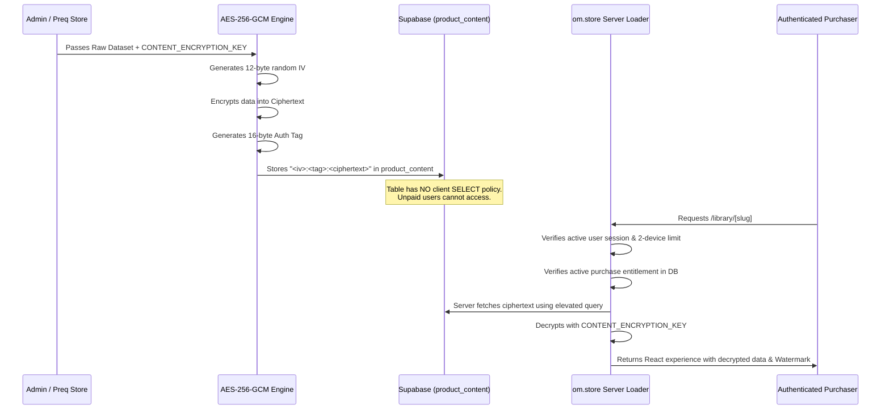

# Om Store & Preq Store: Complete Developer & AI Operations Guide

> **Architecture Purpose:** This platform separates the public storefront application (`om.store`) from private administrative data and content synchronization (`preq.store`). Even if `om.store` is pushed to a completely public/open GitHub repository, **zero raw proprietary data, book texts, company lists, or confidential assets are exposed**.

---

## 1. Architectural Model & Repository Separation

```
pro-testing/
├── om.store/                <-- PUBLIC / OPEN REPOSITORY
│   ├── app/                 # Next.js 16 (App Router, Turbopack, Tailwind/CSS)
│   ├── components/          # Reusable UI, store layout, auth, device manager
│   ├── lib/                 # Decryption runtime, device limits, Razorpay
│   └── products/            # Coded experiences & public metadata ONLY
│       └── [slug]/
│           ├── product.ts   # Public marketing metadata (price, features, FAQ)
│           ├── sample.ts    # Public teaser excerpt for unpaid preview drawer
│           ├── types.ts     # TypeScript interfaces (NO raw data arrays)
│           └── experience.tsx # Interactive UI experience (consumes decrypted data)
│
└── preq.store/              <-- PRIVATE / SECRET ADMIN REPOSITORY
    ├── .env                 # Private Supabase service role key & encryption key
    ├── raw-data/            # RAW PROPRIETARY DATA (books, datasets, companies)
    │   └── [slug]/          # e.g., 144 companies data, full book markdown/json
    ├── lib/encryption.ts    # AES-256-GCM encryption engine
    ├── scripts/sync.ts      # Encryption & direct Supabase database upsert
    └── supabase/            # Private SQL migrations & seed scripts
```

### Core Security Rules

1. **Never commit raw content into `om.store`**:
   - `om.store` only contains UI code (`experience.tsx`), public marketing metadata (`product.ts`), and public teaser excerpts (`sample.ts`).
   - All raw proprietary data belongs in `preq.store/raw-data/[slug]/`.
2. **Encrypted at Rest via AES-256-GCM**:
   - `preq.store` encrypts the raw dataset using `CONTENT_ENCRYPTION_KEY` before storing it in Supabase (`product_content.content_ciphertext`).
3. **Database Row-Level Security (RLS)**:
   - The Supabase `product_content` table has **no public or authenticated client `SELECT` policy**. Direct client queries from browsers or scrapers are blocked by Postgres.
4. **Server-Side Decryption Gate**:
   - Decryption occurs strictly inside the server-side loader (`om.store/lib/products/loader.ts`).
   - Only users with a verified payment entitlement in the `entitlements` table and an active device session receive decrypted content.
5. **Anti-Piracy Watermarking**:
   - Every product experience renders `<ProtectedWatermark />`, dynamically embedding the purchaser's identity (name, email, order ID) across the viewport.

---

## 2. Setting Up the Supabase Database

### Step 2.1: Supabase Project Creation
1. Create a project on [database.new](https://database.new).
2. Go to **Project Settings -> API** and copy:
   - **Project URL** (`NEXT_PUBLIC_SUPABASE_URL`)
   - **Publishable / Anon Key** (`NEXT_PUBLIC_SUPABASE_PUBLISHABLE_KEY`)
   - **Service Role Secret Key** (`SUPABASE_SERVICE_ROLE_KEY` — *keep private in `preq.store/.env`!*)

### Step 2.2: Apply SQL Migrations
In the Supabase SQL Editor, execute the migration scripts located in `preq.store/supabase/` in the following order:

1. **`001_initial_schema.sql`**:
   - Creates all core tables: `categories`, `tags`, `products`, `product_plans`, `product_content`, `licenses`, `coupons`, `orders`, `order_items`, `payments`, `entitlements`, `user_devices`, `reviews`, `audit_logs`.
2. **`002_row_level_security.sql`**:
   - Enables RLS on all tables.
   - Grants public read on catalog metadata, plans, and licenses.
   - **Blocks direct public/client read on `product_content` and private storage**.
   - Restricts orders, payments, entitlements, and devices strictly to the owning user (`auth.uid() = user_id`).
3. **`003_seed_data.sql`**:
   - Seeds default categories (`Engineering`, `Careers`, `Remote Work`).
   - Seeds the initial product definition and plan for `hiring-organizations` at ₹99 INR.

### Step 2.3: Configure Environment Variables

**In `om.store/.env.local` (Storefront Web App):**
```env
NEXT_PUBLIC_SUPABASE_URL="https://your-project.supabase.co"
NEXT_PUBLIC_SUPABASE_PUBLISHABLE_KEY="sb_publishable_..."
NEXT_PUBLIC_SUPABASE_ANON_KEY="sb_publishable_..."

# 32-byte AES-256 Hex Key (MUST match the key in preq.store)
CONTENT_ENCRYPTION_KEY="f3b9c7e2d1a45890e7123456789abcdef0123456789abcdef0123456789abcde"

# Razorpay Configuration (INR currency)
NEXT_PUBLIC_RAZORPAY_KEY_ID="rzp_test_..."
RAZORPAY_KEY_SECRET="your_razorpay_secret"
RAZORPAY_WEBHOOK_SECRET="your_webhook_secret"

NEXT_PUBLIC_APP_URL="http://localhost:3000"
```

**In `preq.store/.env` (Private Admin/Sync Tool):**
```env
NEXT_PUBLIC_SUPABASE_URL="https://your-project.supabase.co"

# Service role key with admin privileges to write to private product_content table
SUPABASE_SERVICE_ROLE_KEY="eyJh..."

# 32-byte AES-256 Hex Key (MUST match om.store)
CONTENT_ENCRYPTION_KEY="f3b9c7e2d1a45890e7123456789abcdef0123456789abcdef0123456789abcde"
```

---

## 3. Step-by-Step Guide: How to Create a New Product

Follow these 7 steps whenever you or an AI agent creates a new digital product.

### Step 1: Create Product Directory in `om.store`
Create directory `om.store/products/[slug]/`:
```bash
mkdir om.store/products/system-design-vault
```

### Step 2: Define Public Metadata (`product.ts`)
Create `om.store/products/[slug]/product.ts`:
```typescript
import { ProductDefinition } from "@/lib/products/types";

export const product: ProductDefinition = {
  slug: "system-design-vault",
  name: "Production System Design Vault",
  tagline: "Interactive architectures, failure mode simulations, and real-world system benchmarks.",
  description: "A comprehensive, practical exploration of high-throughput distributed systems...",
  type: "app", // 'app' | 'ebook' | 'guide' | 'video' | 'template'
  template: "custom",
  capabilities: {
    view: true,
    download: false,
    stream: false,
    watermark: true,
    access: "lifetime",
    device_limit: 2,
  },
  price: 99, // In INR (₹)
  originalPrice: 499,
  currency: "INR",
  categories: ["Engineering", "Architecture"],
  tags: ["Distributed Systems", "Performance", "High Availability"],
  previewChapterId: "preview-chapter",
  features: [
    "Interactive distributed architecture playground",
    "Real-world incident retrospectives and latency calculations",
    "Dynamic cryptographic watermarking on up to 2 active devices",
  ],
  license: {
    name: "Single-User Lifetime License",
    terms: "Grants personal, non-exclusive rights. Redistribution is prohibited.",
  },
  faq: [
    {
      question: "How do I access this after buying?",
      answer: "Instant access is unlocked in your personal library at /library/system-design-vault.",
    },
  ],
};
```

### Step 3: Define Public Teaser / Sample (`sample.ts`)
Create `om.store/products/[slug]/sample.ts` for unpaid visitors to view in the storefront preview drawer:
```typescript
import { StructuredBookContent } from "@/lib/products/types";

export const sampleContent: StructuredBookContent = {
  title: "Production System Design Vault: Sample",
  author: "Om Store",
  version: "1.0.0",
  chapters: [
    {
      id: "preview-chapter",
      title: "Sample Excerpt: Designing for Idempotency",
      description: "A free excerpt demonstrating the depth of content.",
      isFreePreview: true,
      sections: [
        {
          type: "callout",
          variant: "tip",
          title: "Free Excerpt",
          text: "This is a preview of Chapter 1...",
        },
      ],
    },
  ],
};
```

### Step 4: Define TypeScript Interfaces (`types.ts`)
Create `om.store/products/[slug]/types.ts` containing type contracts for the UI experience (NO data arrays):
```typescript
export interface SystemDesignContent {
  title: string;
  version: string;
  scenarios: Array<{
    id: string;
    title: string;
    architecture: string;
    tradeoffs: string[];
  }>;
}
```

### Step 5: Build Custom Interactive Experience (`experience.tsx`)
Create `om.store/products/[slug]/experience.tsx` (must be lowercase `experience.tsx` on Windows):
```tsx
"use client";

import React, { useMemo } from "react";
import { ProtectedWatermark } from "@/components/security/ProtectedWatermark";

export interface ExperienceProps {
  content?: any;
  user?: { id?: string; name?: string; email?: string };
  orderId?: string;
  isFreePreview?: boolean;
}

export default function SystemDesignExperience({
  content,
  user,
  orderId,
}: ExperienceProps) {
  // content is decrypted server-side from Supabase and passed here
  return (
    <div className="min-h-screen bg-[var(--background)] p-6 relative">
      {/* 1. Dynamic Identity Watermark */}
      <ProtectedWatermark userName={user?.name} userEmail={user?.email} orderId={orderId} />

      {/* 2. Interactive Product Workspace */}
      <header className="mb-8">
        <h1 className="text-2xl font-bold">Production System Design Vault</h1>
        <p className="text-xs text-[var(--text-muted)]">Licensed to: {user?.email}</p>
      </header>

      {/* Render interactive scenarios, filters, tools... */}
    </div>
  );
}
```

### Step 6: Register in `om.store/lib/products/registry.ts`
Add the new product to `productRegistry`:
```typescript
import { product as sysDesignProduct } from "@/products/system-design-vault/product";
import { sampleContent as sysDesignSample } from "@/products/system-design-vault/sample";

export const productRegistry: Record<string, RegisteredProduct> = {
  // Existing products...
  "system-design-vault": {
    definition: sysDesignProduct,
    content: sysDesignSample,
    loadExperience: () => import("@/products/system-design-vault/experience"),
  },
};
```

### Step 7: Store Raw Data & Sync via `preq.store`
1. Place the full raw dataset in `preq.store/raw-data/[slug]/data.ts` or `data.json`.
2. In `preq.store/scripts/sync.ts`, add the product configuration:
   ```typescript
   "system-design-vault": {
     slug: "system-design-vault",
     name: "Production System Design Vault",
     tagline: "Interactive architectures and failure mode simulations.",
     description: "...",
     type: "app",
     price: 99,
     currency: "INR",
     version: "1.0.0",
     licenseName: "Single-User Lifetime License",
     licenseTerms: "...",
     capabilities: { view: true, download: false, stream: false, watermark: true, access: "lifetime", device_limit: 2 },
     getData: () => fullSystemDesignRawData,
   },
   ```
3. Run the sync command:
   ```bash
   npm run sync:system-design-vault --prefix "../preq.store"
   ```
4. **Done!** The product is live on `om.store` storefront at ₹99, with zero raw data stored in git.

---

## 4. How Product Sync & AES-256-GCM Encryption Works



### Ciphertext Payload Format
Ciphertexts stored in `product_content.content_ciphertext` follow this standard format:
```text
<iv_hex>:<auth_tag_hex>:<ciphertext_hex>
```
- **IV (`iv_hex`)**: 12 bytes (96 bits) randomly generated per encryption run. Ensures identical plaintexts produce completely different ciphertexts.
- **Auth Tag (`auth_tag_hex`)**: 16 bytes (128 bits) verifying payload authenticity and preventing tampering.
- **Ciphertext (`ciphertext_hex`)**: Encrypted UTF-8 JSON payload.

---

## 5. Verification Commands & Testing Checklist

Always run these verification commands before deploying or pushing changes:

```bash
# 1. Type check om.store (must be 0 errors)
npx tsc --noEmit

# 2. Build production bundle (verifies all static and dynamic pages)
npm run build

# 3. Test preq.store encryption sync
npm run sync:hiring-organizations --prefix "../preq.store"
```

### Manual Testing URLs
- **Storefront Home**: `http://localhost:3000/`
- **Product Landing Page**: `http://localhost:3000/products/hiring-organizations`
- **Preview Drawer**: Click **"Read Free Chapter 1 Excerpt"** on the product page
- **Purchaser Experience (Dev Inspection)**: `http://localhost:3000/library/hiring-organizations?dev_preview=1`
- **Unpaid Protection Test**: Navigate to `http://localhost:3000/library/hiring-organizations` in an Incognito window — verify redirect to `/auth/login`.
